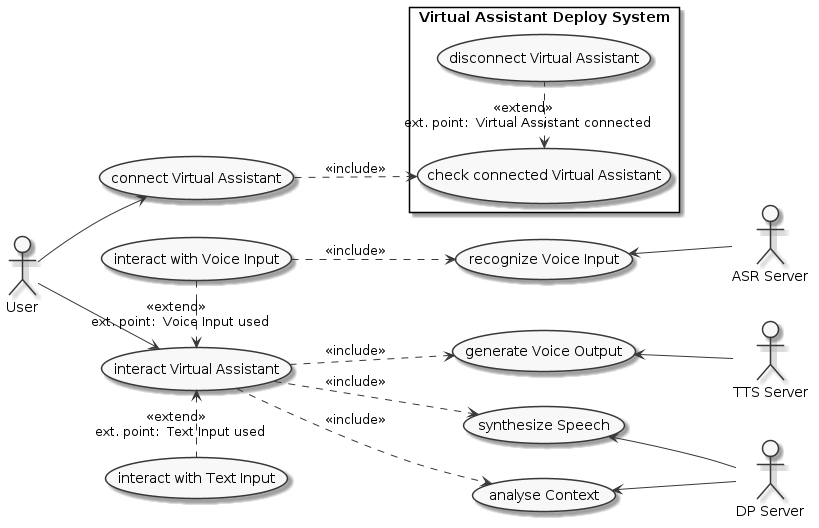

# Description
При анализе приложения для подключения виртуального ассистента были созданы артефакты:
- диаграмма прецедентов
- диаграмма состояний
- сценарий прецедента "взаимодействие с виртуальным ассистентом"

# Use Case Diagram

# Virtual Assistant State Machine Diagram

# Use Case Scenario
[Сценарий взаимодействия с виртуальным ассистентом](./uc1-interact-va-with-text.md)
