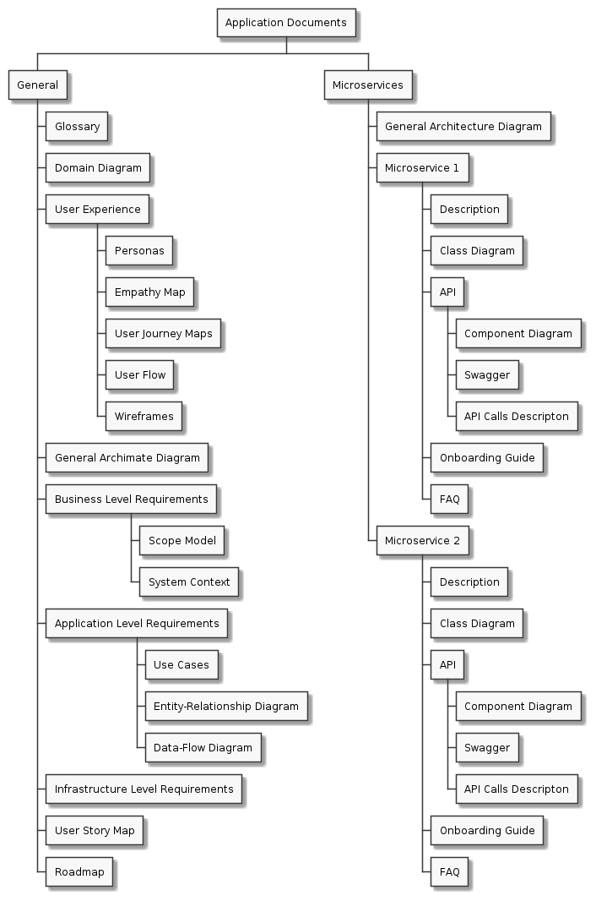

# Abstract
Для описания приложения на основе микросервисов была подготовлена информационная архитектура документации. Описание архитетуры представлено в виде диаграммы.

# Information Architecture Diagram

# Comments
Для описания микросервисв были выбраны следующие разделы:
- Описание: содержит общее описание сервиса, позволяющее в общих словах понять зачем сервис был реализован и как он работает
- Class Diagram: позволяет получить представление об архитектуре микросервиса
- **Описание API** Component Diagram: позволяет визуализировать интерфейсы микросервиса
- **Описание API** Swagger: позволяет полностью описать API микросервиса в формализованной форме
- **Описание API** Описание API: содержит подромную спецификацию каждого метода с указанием примеров вызовов, описанием параметров, описанием структур данных, возвращаемых в результате вызова методов
- Onboarding Guide: содержит описание работы с микросервисом, подготовленное для адаптации новых сотрудников
- FAQ: содержит описание особенностей микросервиса, а так же является инструмент обратной связи, позволяющем оперативно изменять документацию в процессе реализации и использования микросервиса
